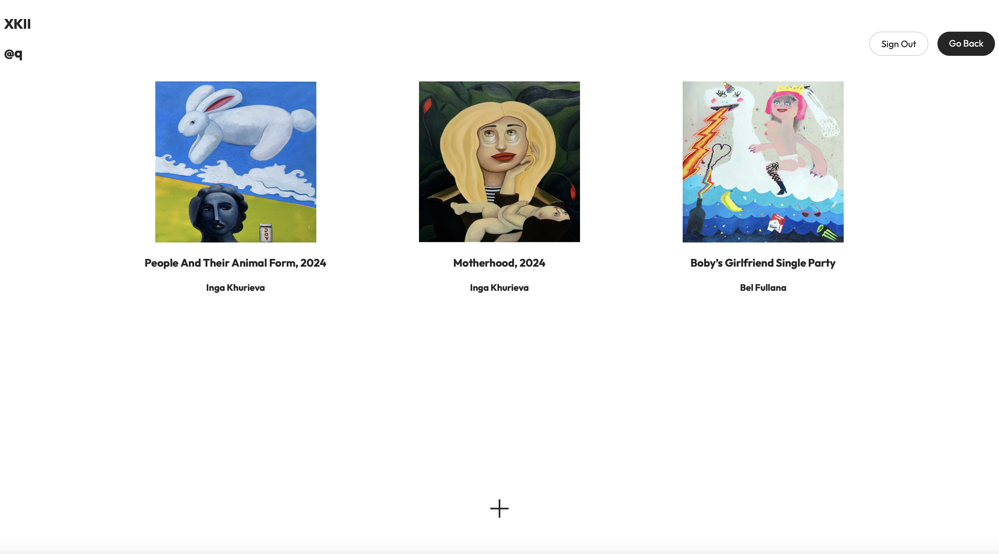

# Artworks collection

## Description of Project

The Artwork Collection App is designed to allow users to manage their personal collections of artworks. Users can sign up, log in, and have full control over their artworks, including adding new pieces, viewing detailed information, editing, and deleting items from their collection. The app will provide an intuitive user interface, ensuring a seamless experience from registration to collection management.

## Github link

The code for this project can be found [here](https://github.com/itsxavchen/artworks-project-2).

## How to use

New users must sign up to access the artwork collection app, while registered users can simply sign in with their username and password. Once logged in, they can click the "+" button at the bottom to add their artworks. For additional details, users can click on a picture to view more information about the artwork. They also have the option to edit or delete their artworks. The "Go Back" button allows users to return to the previous page.

## Deployment Link

https://artworks-xkii-app-aa04f01620aa.herokuapp.com

## Planning Materials

I began planning this project on Trello and created wireframes in Figma. Additionally, I used Figma to outline the data information, detailing the relationships between my schemas and models.
[Trello board](https://trello.com/invite/b/6725c0a03e2b237bd844aab2/ATTI52289fd9b562e3cc4ed3fa4b6622d2460C6C9A25/art-collection-app-project-plan)

## Technologies used:

1. **HTML**
2. **CSS**
3. **JavaScript**
4. **Markdown**
5. **EJS**
6. **Node**
7. **Express**
8. **Mongoose**
9. **MongoDB**
10. **Connect-Mongo**
11. **Express-Session**
12. **Morgan**
13. **Bcrypt**
14. **Method-Override**
15. **dotenv**

## Future plans/improvements

* Improve CSS